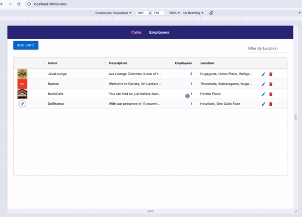
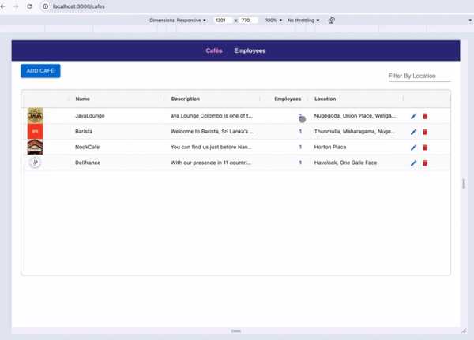

# Café Employee
Assessment for Café Management system which uses a Node.js backend and React frontend (React, TypeScript, Redux, Redux-saga, AgGrid, Material-UI)

## Setup Frontend
1. Navigate to `frontend` folder
2. Node version - `20.0.0`
3. After installing Node, run `npm install` to install the dependencies

## Setup Backend
1. Navigate tp `backend` folder
2. Node version `20.0.0`
3. After installing Node, run `npm install` to install the dependencies
4. Add the .env file shared to root of backend folder (contains DB connections)

## Demo

